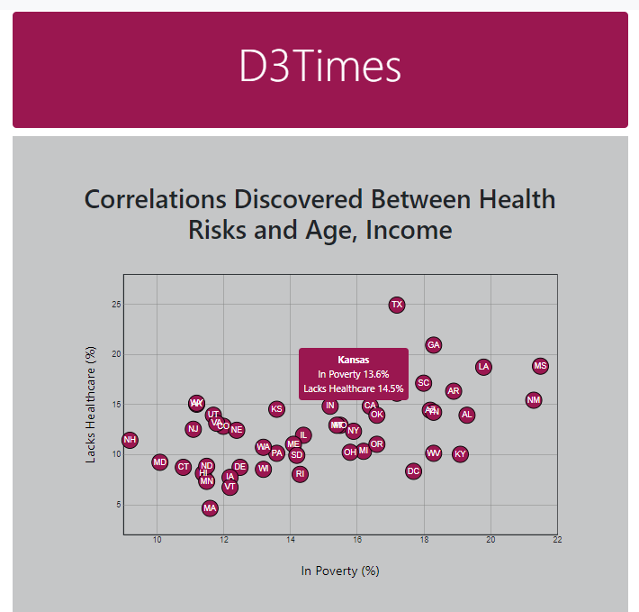
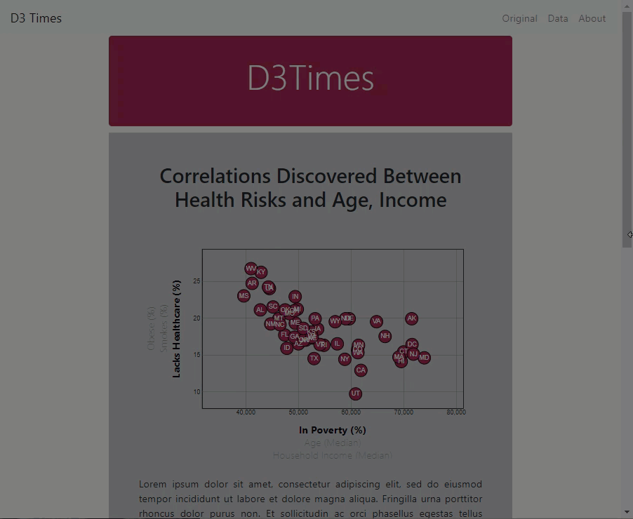
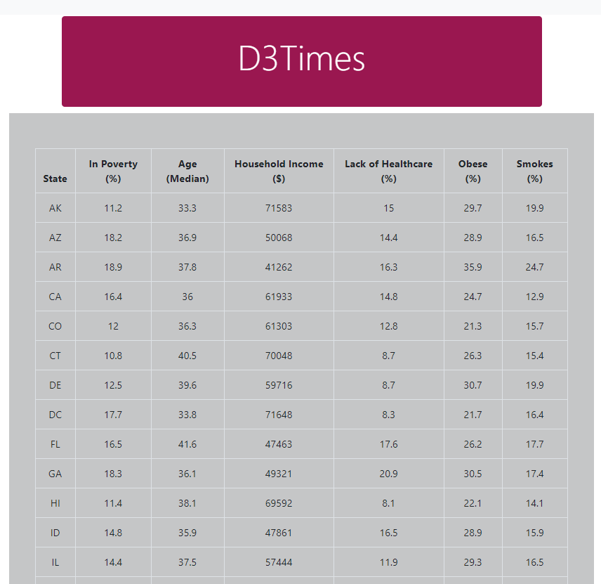

# D3 Data Visualization

## Rice University Data Analytics and Visualization Boot Camp 2020

This repository contains the following scenario and the final product is available [here](https://gpivaro.github.io/D3-Challenge/).

Analyzing the current trends shaping people's lives, as well as creating charts, graphs, and interactive elements to help readers understand your findings.
The data set is from the U.S. Census Bureau and the Behavioral Risk Factor Surveillance System and can be used to tell a story about the health risks facing particular demographics. The data set included is based on 2014 ACS 1-year estimates from the [US Census Bureau](https://data.census.gov/cedsci/). The current data set includes data on rates of income, obesity, poverty, etc. by state. MOE stands for "margin of error."

- - -

### D3 Dabbler

Create a scatter plot between two of the data variables such as `Healthcare vs. Poverty`.

Using the D3 techniques to create a scatter plot that represents each state with circle elements. The code for this graphic in the `app.js`. Pull in the data from `data.csv` by using the `d3.csv` function. The scatter plot is the image at the top of this section. You can see the final product by clicking [here.](https://gpivaro.github.io/D3-Challenge/index_1.html)

The scatter plot has the following features:

* Include state abbreviations in the circles.

* The axes and labels are in the left and bottom of the chart, respectively.

Note: You'll need to use `python -m http.server` to run the visualization. This will host the page at `localhost:8000` in your web browser.

- - -

### Bonus: Impress the Boss

Why make a static graphic when D3 lets you interact with your data?

#### 1. More Data, More Dynamics

Include more demographics and more risk factors. Place additional labels in the scatter plot and give them click events so that your users can decide which data to display. Animate the transitions for the circles' locations as well as the range of the axes. There are three transitions for each axis.

#### 2. Incorporate d3-tip

While the ticks on the axes allow us to infer approximate values for each circle, it's impossible to determine the true value without adding another layer of data. Enter tooltips: developers can implement these in their D3 graphics to reveal a specific element's data when the user hovers their cursor over the element. Add tooltips to your circles and display each tooltip with the data that the user has selected.

The final result of this part is at the top of this section. The bonus part is available [here.](https://gpivaro.github.io/D3-Challenge/)

- - -

### Responsiveness with D3 and Bootstrap.

Using D3 to create an event listener to keep track of the size of the Bootstrap container and adjust the SVG size to better fit each size of the screen. You can check it by accessing this web application on your full-size desktop screen or on your mobile device.

- - -

### Table with the source data

Include a table with the data used to create this web application. The table is available [here](https://gpivaro.github.io/D3-Challenge/table-data.html).

